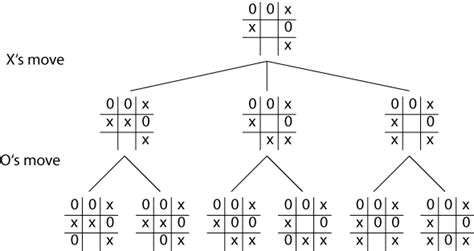

# Artificial intelligence algorithms

### Basic artificial intelligence or maths auxiliary algorithms

## 1. MiniMax (TicTacToe)

MiniMax is one of the most simpe Maths/A.I. algorithms yet so powerful. The algorithm is used in decision making and game theory. The idea is to make the best decision for a certain state e.g. where should we move our pawn in chess or our X in TicTacToe. The current implementation is based on TicTacToe so most of the documentation and code examples are going to be about this particular game.

The workflow follows these steps:

1. Check if the state is already in a winning situation. (If yes, just return the outcome - winner, else continue)
2. Get every possible move (A tree)
3. And here comes the hard part: for every possible move perfom MiniMax on the modified state :D
4. Return the best outcome of the possible moves based on player's turn

Here you can see a tree of possible moves in a particular state:

Some basic functions are neccessary for the work of the algorithm. They can be found in tictactoeaddons.py.
Note that the more moves are available in the current state, the longer time it will take for the algorithm to find the best path
