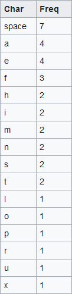
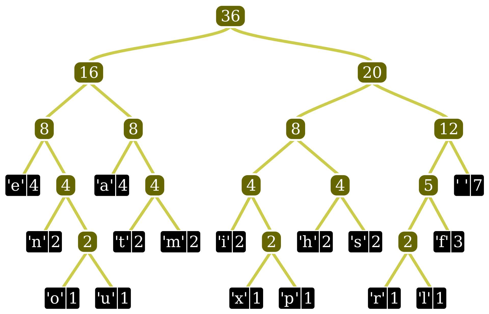
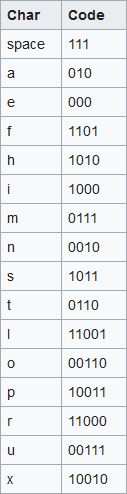
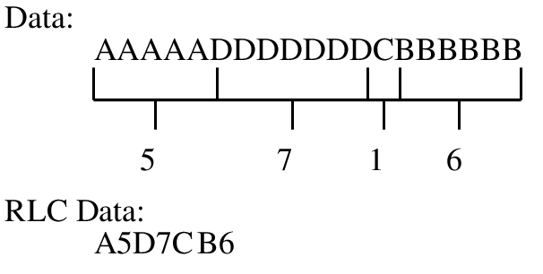

# Compression algorithms

### A compression algorithm aims to store data into less space (bits) than it usually takes.

## 1. Huffman coding

Huffman compression (a.k.a Huffman coding) is an algorithm used to compress data, in a lossless way, using a "look-up" table derived from the "Huffman tree".

Steps:
1. Construct a char-frequency (occurrences) table from the data (text).
2. Construct a Huffman tree (look-up table), a tree structure is built from the char-occurrences table.
3. Construct a char-binary representation table from the Huffman tree.
4. Replace every char from the original data (text) with its binary equivalent, found in the char-binary representation table.

Input: Data (most commonly some form of a text).
Output: Direct binary representation of the compressed text.

Example:
Input: "this is an example of a huffman tree"

1. Constructing a char-frequency table:

2. Constructing a Huffman tree:

3. Constructing a char-binary representation table:

4. Replace every char from the input data with its binary code representation:

Output: 001111010001100111100011001111000010111110010110000101010010111101001110111010111110001111101001101011101110100000101111001100010100100

It takes 288 bits to store the input data and 135 for the compressed data, 153 bits are saved.

## 2. Run-length encoding

Run-length encoding is an algorithm used to compress data, in a lossless way, benefiting from the high frequencies of characters in the input text.

Steps:
1. Iterate through the input data.
2. Count how many times a symbol has occurred in a row.
3. When you reach a new symbol, add the old symbol + its occurrences to the output data (If a symbol has occurred just once, just add the symbol without "1").

Input: Data (mostly used on data with high repetition of chars, DNA for example (Because there chars there are only A, C, T and G))
Output: Compressed data (text)

Example:
Input: "AAAAADDDDDDDCBBBBBB"

1. Iterate through the data and count char frequencies.
2. Append the char + occurrences to the output data.

Output: A5D7CB8

It takes 152 bits to store the input data and 56 for the compressed data, 96 bits are saved.
