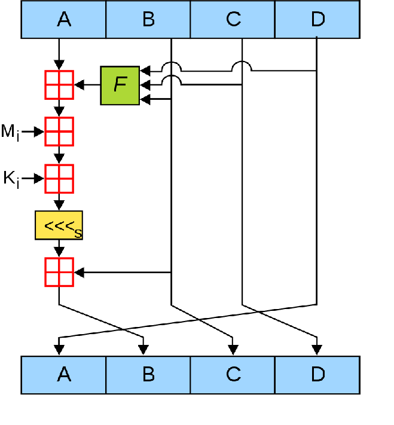

# Cryptography algorithms

### Cryptographical algorithms are used to make a communication in a network more secure and reliable - they might be key-exchanging algorithms, encryption algorithms, and so on.

## 1. Advanced encryption standard (Rijndael)

Advanced encryption standard (AES, Rijndael) is an algorithm used to encrypt/decrypt data efficiently. AES uses a predefined key for the encryption/decryption process and
this way it is very hard for an attacker to break the cipher (encrypted data). The algorithm uses several functions to finish its goal.

What a round of AES looks like:

Predefined functions:
1. AddRoundKey - each byte from the main 128-bit block is "xor-ed" with another 128-bit block derived from the AES key schedule.

2. SubBytes - each byte from the main 128-bit block is replaced with another one found in a premade look-up table.

3. ShiftRows - the last three rows from the main 128-bit block are shifted, depending on the row number.

4. MixColumns - an operation, working on the columns of the main 128-bit block, used to mix the bytes linearly.

Steps:
1. Divide the whole message into 128 bit (16 chars/bytes) blocks.
2. Form the AES key schedule list
3. Now the operations begin:
    1. Execute the AddRoundKey
    2. Depending on the length of the initial key (128 bit - 9, 192 bit - 11, 256 bit - 13) repeat these steps down below
          1. Execute SubBytes
          2. Execute ShiftRows
          3. Execute MixColumns
          4. Execute Add Round key
    3. Repeat the steps above for one last time, but this time without the MixColumns function
4. Do steps 2 and 3 for every block
5. Concatenate the results from every block into a string - this is the encrypted message

Input: Data (most commonly some form of a text), Key (128, 192, 256-bit text)
Output: Encrypted message of the same length as the input data (some chars might not be in the normal ASCII table, so if you try
to print out the result, you might get some strange symbols)

Example:
Input: message = "Good afternoon!!" key = "87asd5gf6h4j3kk0"

We perform the steps above and we get this strange piece of characters:
-> "N°Cµ'j†Jå`!gd©¼"

## 2. Diffie-Hellman key exchange

Diffie-Hellman is an algorithm used to establish a symmetric key between two hosts (users) securely. The efficiency comes from the mathematical concept
of function invertibility. Consider the example of the multiplying - it is easy to find the product of two numbers (because the product is always the same),
but it is hard to find the exact numbers that formed the product (because they can be large combinations). We want to end with an identical key on both sides of the communication
without the risk of an attacker (sniffing the network for example) to find out.

This picture demonstrates a sample Diffie-Hellman between two users - Alice and Bob. In this case, the key is a color so it is kind of easy to find out the two colors that formed it,
but with numbers it is much much harder:

Steps: (We are going to use Alice and Bob for the normal users and Eve for the attacker)
1. Alice and Bob agree on two common numbers P and G and store them (Eve also gets these numbers because they are transported via the network as a plain text).
2. Alice and Bob choose their own private number (Eve might do that too).
3. Alice and Bob calculate their public keys ((G ^ Private number) mod P).
4. Alice and Bob now transfer their public keys (Eve collects this information too).
5. Allice and Bob calculate another number - the final key ((Other's public key ^ Private key) mod P).
6. Now Allice and Bob have their identical keys and Eve is only left with P and G and Allice's and Bob's public keys.

~ Eve might try to calculate the final key, but this is a lot of mathematics and it is expensive to compute that.

Input: Just an open connection that is capable of transferring data.
Output: Two identical (symmetrical) keys on both sides.

Example:
1. P and G are agreed to be 13 and 6.
2. Alice chooses 5 for the private key and Bob chooses 4 for the private key
3. They calculate their public keys and end up with Alice - 2, Bob - 9
4. Now they exchange their public keys.
5. Alice and Bob calculate their final key and both result in 2 as a final key.
6. Everything is easy from now on and they can start communicating encrypted and securely (for example they can use AES mentioned above).
(In practice a lot bigger numbers are used)

~ Eve ends up with P=13, G=6, Alice's public = 2, Bob's Public = 9.

Unless Eve owns a quantum computer, it would be hard for their side to break the connection (Well, if somebody in your network really owns a quantum computer or
just a fast enough one, then I am worried about you :D).

## 3. Message Digest 5 (MD5)

Message digest 5 is simply a hash function. The algorithm is used in cryptography (for storing passwords) and in networking (data integrity). The algorithm
takes input of any length and produces a fixed length (32) hex characters hash. Again, we use the secure property of function invertibility - a.k.a we know that f(x) is producing y, but we are not sure in the x value in f(x) inverted. There are two main steps - modifiyng the input text and doing some calculations based on it.

A good use of MD5 is to check if a file has been transmitted correctly between two parties. We simply hash the file before it is sent, and we ask for the party that received the file to hash it too and we compare both output hashes. (Basically you can think of the hash of a file as its fingerprint).

Down below is a good graphical representation of the algorithm

Steps:
1. Initialize 4 buffers (A, B, C, D) - constants
2. Initialize a bit representation of the input text
3. Append one 1 bit and add 0s till the length of the bit representation satisifes this: length % 512 = 448
4. Append the length of the input text as a 64 bit number
5. Divide all the bits into 512 bit blocks
6. For every 512 block do 4 rounds, consisted of 16 operations \\/:

7. When the last block is processed represent the buffers as hex values and append them to each other to get the resulting 32 hex character hash

Example:

Input 1: "Hello, I implemented this algorithm on 11/23/2020 for several hours and I am happy about it"

Input 2: "Hello, I implemented this algorithm on 11/23/2020 for several hours and I am happy about it."

Output 1: "884dc0121a6cfec5ca9005c8e4495a53"

Output 2: "96ce656125b9e8e29d2158973cca058a"
  
Here you can see the avalanche effect (which is a good property of the MD5) - we added just a dot in the input and the output hash changed a lot

We must note that:
Consider two inputs - messsage1 and message2. Now consider the hashes of the inputs. If the inputs result in the same hash then we have a HASH COLLISION.
This is a vulnerability of the algorithm since we can make use of equal "fingerprints" and different files. It is easy to find hash collision due to the birthday problem
which is not going to be explained but you can read more about breaking MD5 here:

https://www.mscs.dal.ca/~selinger/md5collision/

!DISCLAIMER! The algorithm should not be used in any real situation since nowadays MD5 is inefficient and breakable. !DISCLAIMER! 
