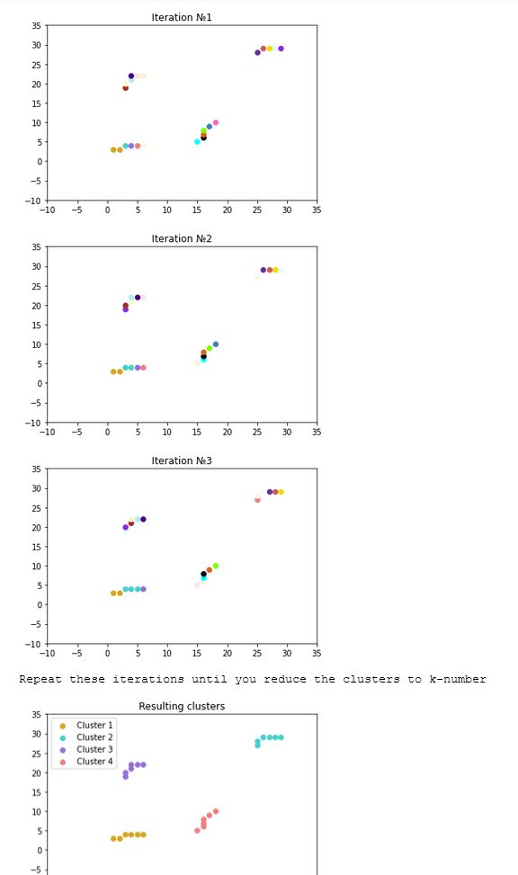
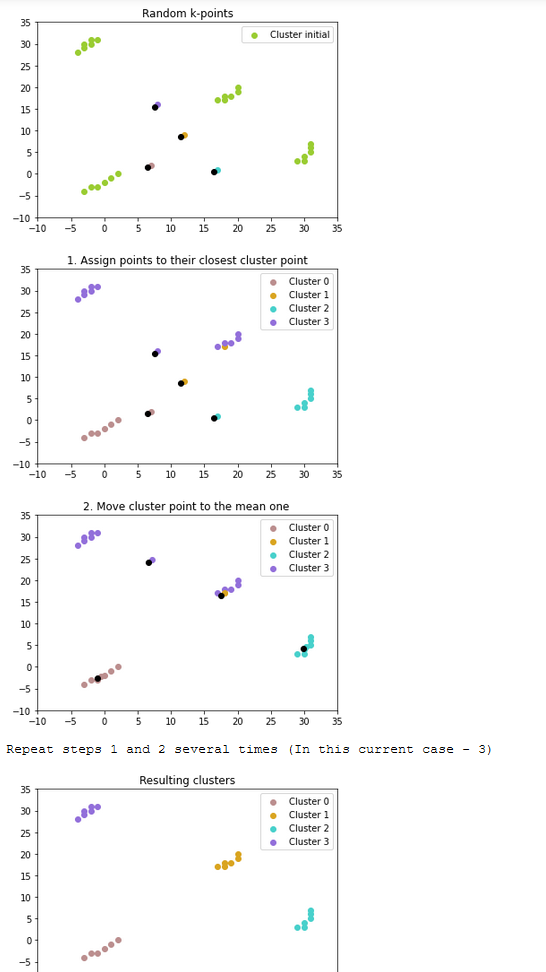
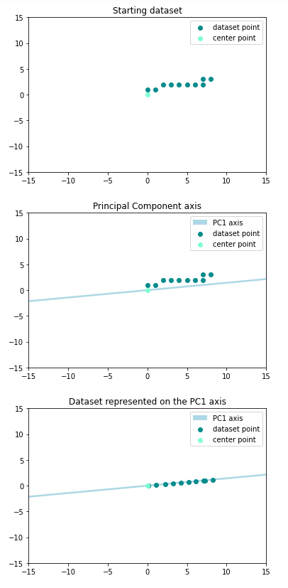

# Data-Science algorithms

### Most of the data-science algorithms aim to do some operations on big/small datasets or gather information from them

## 1. Cluster Analysis

Cluster Analysis is a data-science technique used to form groups with similar objects. It is used a lot in recommendation systems (YouTube, Facebook and so on...) -
for example, you can be in a certain group and be recommended with videos that the other people in your group watched. Groups are called clusters.
In this repository, there are clustering algorithms - k-means and hierarchical clustering. You might be wondering why we need special algorithms to do that, but
consider millions of elements to cluster also notice that for a human it is easy to find out how many clusters a dataset can form, but for computers, it is harder.

In the examples below, we are grouping similar 2D points

Input: Dataset

Output: Clustered dataset

##  1.1.  Hierarchical Clustering

Steps:
1. Get starting dataset
2. Assign every point from the dataset to be its cluster - 10 starting points, 10 clusters
3. Find out k - how many clusters are needed to group the dataset efficiently (There is another algorithm just for that, but for the sake of the example, we are going to use predefined k from the function that generated the dataset).
4. Start grouping the closest points into one cluster (Be careful to not group points that are already in the same group (cluster)).
5. Do that until you reduce the clusters to k.

Example:

##  1.2. K-means clustering

Steps:
1. Get starting dataset
2. Find out k (again, we use a predefined k).
3. Construct k random main points.
4. Assign every point to its closest main point (a.k.a form a cluster).
5. Now find the average point for every main point (Average arithmetical from all the coordinates of points that are in this cluster).
6. Now repeat steps 4 and 5 until you get good enough clustered points (In our case we are doing it 3 times because it is enough for small datasets).

~ Notice that the K-means algorithm is not so effective because the result might be different every time (This comes from the third step - construct RANDOM points)

Example:

For a conclusion - hierarchical clustering is a way more effective thank-means (depending on the dataset).

## 2. Principal Component Analysis (PCA)

Principal component analysis (PCA) is a data-science algorithm used mainly to transform big-dimensional datasets into smaller ones.
This is done via some math concepts like vectors, matrices, and transformation.

Steps:
(Example for a 2D set to 1D set)
1. Calculate the axes variances (In 2D we have 2 axes, so we get 2 variances values)
2. Calculate the covariance (In 2D the covariance matrix, covariance is mostly the correlation)
3. Construct the sigma matrix (often called covariance matrix but it is confusing with the covariance value)
4. Think of the sigma matrix as a transformation matrix
5. Find the eigenvectors and eigenvalues of the sigma matrix
6. Get the biggest eigenvector (In 2D we get the biggest from the two)
7. Project every point from the 2D plot on the eigenvector
8. Now we got 1D dataset out of the 2D one, every point is characterized just by the distance from the center of the eigenvector, rather than x and y coordinates

~ In the example below, PCA1 is the bigger eigenvector (scaled and flipped so we can look at it as an axis)

~ In practice the algorithm might be used to transform hundreds of dimensions into several (This is commonly used in face recognition!)

Input: 2D dataset

Output: 1D dataset

Example:

