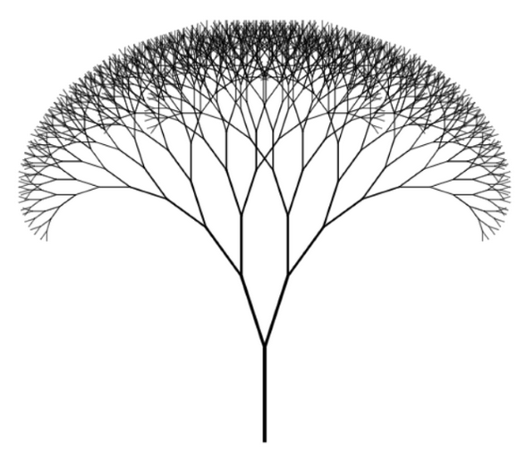
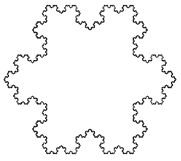

# Drawing algorithms

### Pretty simple algorithms used to draw something (in this case fractals) using some form of mathematics and programming.

The structure of all algorithms is merely the same - a basic recursion (No need to explain more).

## 1. Fractal tree

A simple tree-like structure, where each branch produces 2 others which are under a special degree.

Example:

## 2. Koch snowflake

A snowflake-like structure, where every part is a little snowflake too :D

Example:

