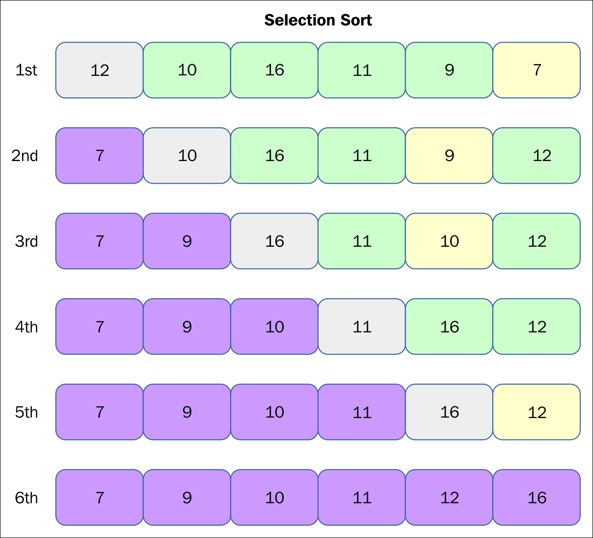

# Sorting algorithms

### A sorting algorithm aims to sort a data structure by some factors.

In this case, we are using algorithms to sort a list by the numerical value

# 1. Insertion sort

Complexity: elements length ^ 2

Steps:
1. Iterate through the list
2. For every current element, iterate through the elements before it
3. If we find a greater value - we continue until we find a smaller value and we place it after the smaller value, if not we go to the next element.

E.g. 1, 2, 3, 5, 6, 4, considering our current element is 4 we go until we reach the smaller value, which is 3, and we put 4 after it

Example:

# 2. Selection sort

Complexity: elements length ^ 2 + elements length

Steps:
1. Construct a new list
2. Find the minimum value from the initial list and remove it
3. Place the minimum value in the new list
5. Do that until the new list reaches the initial list length or the initial list gets to zero elements

Example:

